# Telecomm Churn Analysis

## Project Overview

This project analyzes the different reasons for which customers churn in the telecomm sector. Key themes or factors examined are:
- gender, age
- location : states, cities
- tenure, salary, number of dependents
- data usage

Workflow in this project:
- Step 1 : Exploratory Data Analysis(EDA) using MySQL
- Step 2 : Descriptive and Prescriptive Analysis using Excel
- Step 3 : Visualisations using Power BI

## Data Source
- **Kaggle Dataset Link**: [`kaggle dataset link`](https://www.kaggle.com/datasets/suraj520/telecom-churn-dataset)
- **Actual Dataset copy in inside this repo**: [`source dataset`](data/telecom_churn.csv)
- The dataset has around 14 columns and 2,43,554 rows

## How to Use this Repo
- For obtaining the dataset -> [`source dataset`](data/telecom_churn.csv)
- For viewing Exploratory Data Analysis via MySQL :
    - [`Manya's exploratory sql analysis`](analysis/manya_sql.sql)
- If unable to import csv file into MySQL Workbench, you can load first 20 rows into a table -> [`table script with first 20 rows of source data`](analysis/sql_dataset_script.sql)
- To view Excel Analysis (have to download):
    - [`Manya Excel Analysis`](analysis/manya%20telecomm%20analysis.xlsx)
- To view Power BI reports / dashboards (have to download):
    - [`Manya Power BI dashboard`](visuals/Telecomm%20Churn%20Visualization.pbix)

## Problem Statement

### Univariate Analysis
- **Age Groups Demographics** : Overview of how our customers are distributed across age groups
- **Total Customer Count** : The number of customers in the dataset
- **Churn Rate** : The ratio of customers who churned divided by total customers
- **Gender Demographics** : Understanding how many of the customers are male and female
- **Total Customer Count per Telecomm** : Understanding how customers are split between the different telecomms

### Bivariate Analysis
- **Relationship of Churn with Gender** : Impact of Gender on Churning
- **Relationship of Churn with Age Groups** : Churning across different age groups
- **Relationship of Churn with Salary** : Analysis of churning across 3 groups - high salary, low salary and normal
- **Relationship of Churn with Tenure** : Analysing if older customers churn more or new customers churn more
- **Relationship of Churn with Number of Dependents** : Trend between churning and increase of dependents on the customer
- **Relationship of Churn with Number of Data Usage** : Examining if providing more data prevents churn
- **Churning share across different states** : Examining how churning is divided between the states
- **Trend of Churn across Cities** : Examining which cities have higher churn compared to their counterparts

## Immediate Findings

## Univariate Analysis Findings
- **Age Groups Demographics** : 

- **Total Customer Count & Churn Rate with Telecomms** : 

- **Gender Demographics** : 

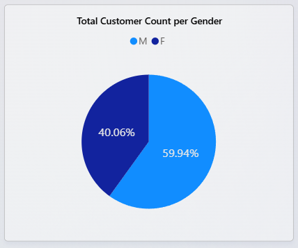

- **Total Customer Count per Telecomm** : 

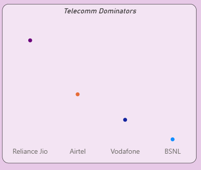

## Bivariate Analysis Findings
- **Relationship of Churn with Gender** : 

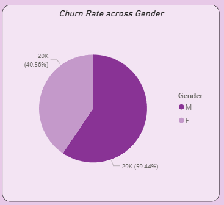

- **Relationship of Churn with Age Groups** : 

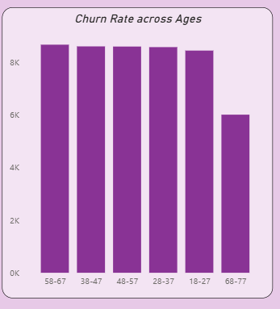

- **Relationship of Churn with Salary** : 

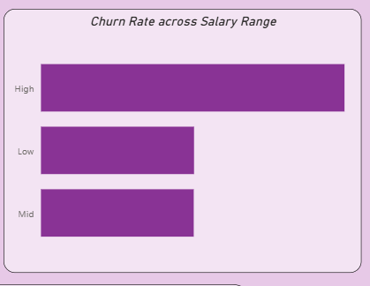

- **Relationship of Churn with Tenure** : 

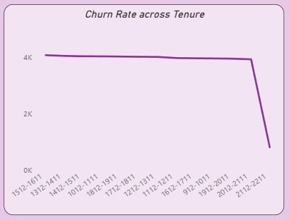

- **Relationship of Churn with Number of Dependents** :
- 
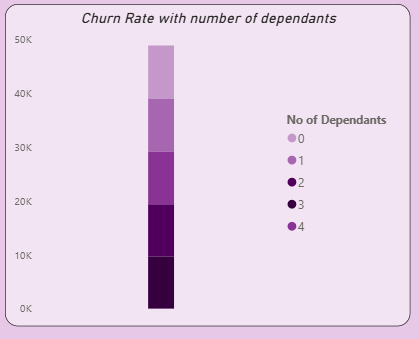

- **Relationship of Churn with Number of Data Usage** : 

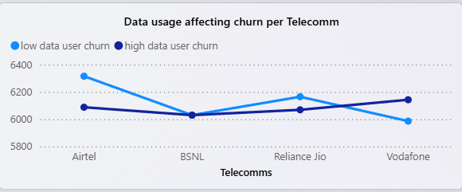

- **Churning share of different states** : 

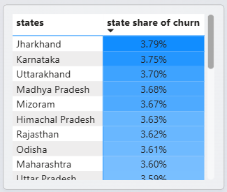

- **Trend of Churn across Cities** : 

## Key Insights
| Inquiry | Actionable Insight |
|------|------|
| Effect of gender on churning | Among churning customers - males:60% and females:40% |
| Effect of age groups on Churning | Except the Age Group of 68-77, all age groups have even churning trend  |
| Effect of customer's salary on Churning | Both high and low salary people churn less |
| Effect of tenure on churning | Depends on the telecomm under study |
| Effect of number of dependents on churning | Churning is min. if 3, max. if 0 |
| Effect of individual data usage on churning | Depends on the telecomm under study |
| Effect of states on churning | Evened out share, but maximum churn in Jharkhand |
| Effect of cities on churning | Hyderabad has max. churn |

## Visualization
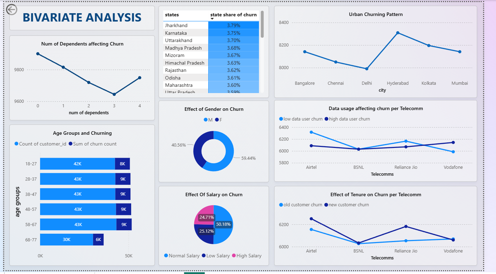
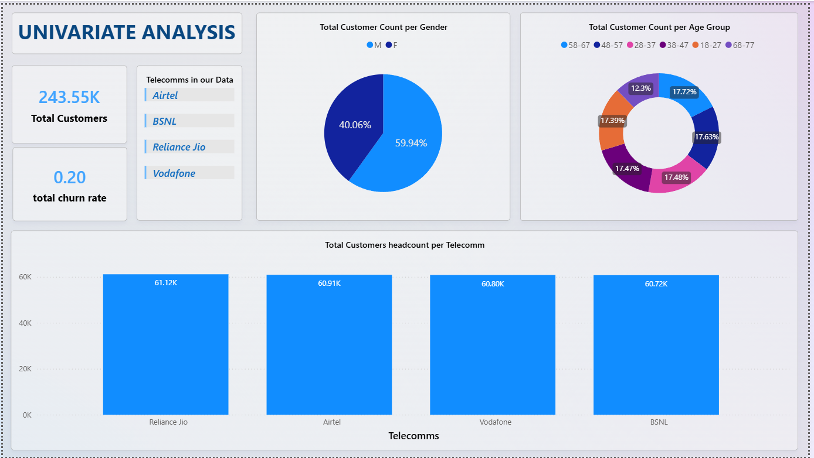
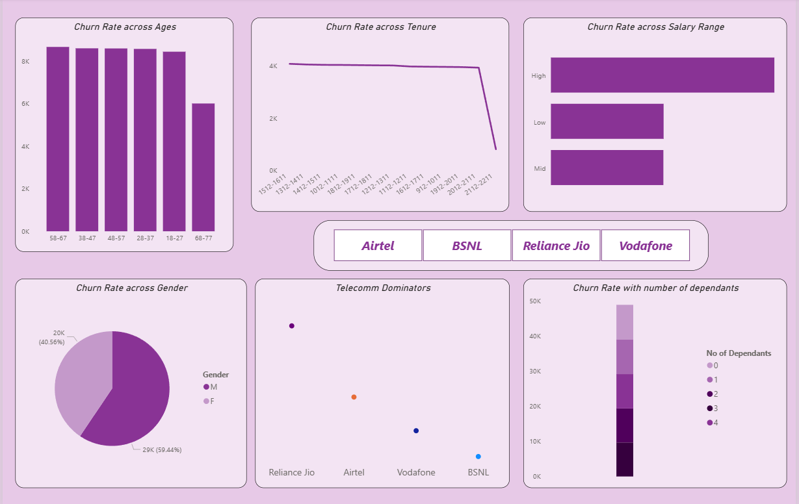
